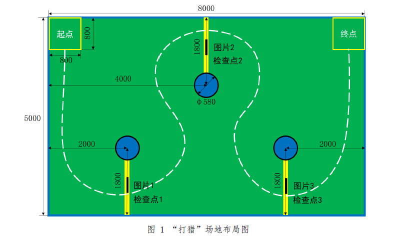

# Computer Design Competition:All Terrain Challenge

这是2021年全国大学生计算机设计大赛人工智能挑战赛-全地形挑战项目留存

## 赛题：全地形挑战赛

让机器狗模仿猎狗跟随猎人打猎，要无碰撞通过检查点，并在检查点处完成猎物识别，语音播报。
<div align="center"></div>

##图像数据集

Animals-10：https://www.kaggle.com/alessiocorrado99/animals10
要求使用PaddlePaddle开发（*不允许使用额外资料）

##硬件设备
- UP Board 
  - 深度相机D435i 
  - 六麦麦克风阵列
  - 超声波雷达
  - 单线激光雷达[选配]
- NVIDIA Xavier NX 
  - 广角相机
  - 16线激光雷达[选配]

##算法设计

### peopleTracking-deeprobotics

行人检测、追踪模块，使用`yolo v3+deepsort`完成

```angular2html
roslaunch start.launch
```

### detect.py
动物识别与播报模块,使用`Paddlex`的`ResNet50_vd_ssld`完成

`paddlex inference 格式的导出方法`：https://paddlex.readthedocs.io/zh_CN/release-1.3/deploy/export_model.html

设备：Intel Realsense D435i
```angular2html
python detect.py
```


### Siamban/demo.py

将siamban修改为可框选跟踪且用于D435i的代码。